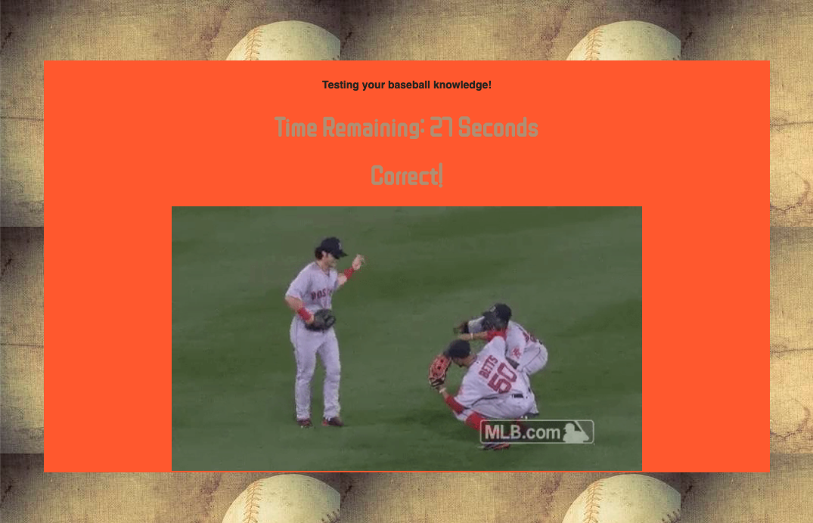

# Unit 5 Assignment: Trivia Game

Link to assignment: https://xieandrew2235.github.io/TriviaGame/

For this assignment I chose to create a trivia game that did not utilize the radio selector for jQuery. The game is baseball themed, and the player is given 30 seconds to answer each question, one-by-one, and the user will be notified of one of three possibilites in each question:

* That he/she either has chosen the correct answer
* That user has chosen the wrong answer and then will be given the correct answer
* Notified that time has run out

There is a 5 second delay set between questions for the user to enjoy a baseball GIF. The user is given the option to restart the game when all 5 questions have been gone through, and also will be presented with his/her score (Correct Answers, Incorrect Answers, Unanswered).

For the styling, I tried my best to make it Giant-themed colors, while not going too overboard, so I settled for a standard picture of a baseball as my background image. For my font, I used a font from Google Fonts (ZCOOL QingKe HuangYou, cursive).

## How I completed this assignment

I created variables for
* Counter starting number (30)
* Questions (I listed my questions under a "questions" array, along with the answers, correct answer, and GIF that plays when finishing a question)

For the countdown function I made it so that "game.counter" would decrease, and if the counter hit 0, the user would be notified that time is up. For each question, the game counter is refreshed so that it starts again at 30 seconds, and with "game.currentQuestion", the next question in the array is loaded.

The correct answer is listed in the array, and is checked by matching the user target click to the current question of the array, along with the answer. In either instance of answering the question correctly or incorrectly, the timer is reset and the user is notified of whether or not the selected answer was correct; if wrong, the correct answer is given to the user.

In the beginning, I struggled a bit with the use of append. After struggling a bit with the Stopwatch activity and others that used append, I went through those activities again with a classmate when Jimmy slacked out the solved code, and played around with it to apply it to this homework.

### What I wanted to do that I didn't do

* I wanted to add a caption that described a baseball player to each GIF upon the completion of a question, but I think with the way my variables were set up, it was kind of a mess adding it in, because I tried a few times and it either cut the GIF off, or made the timer not as functional. 
